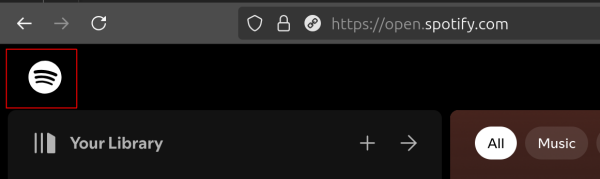

# spotify-play-random-album

This script repurposes the Spotify logo button on the Spotify website to play a random album from the your Spotify library. It fetches your saved albums, selects one at random, and starts playback.
 
Run the code in a tab with https://open.spotify.com/ open, using either the JavaScript console (Dev Tools) or a bookmarklet (code below).
 
After running the code, use the Spotify logo button to play a random album (or run `playRandomAlbum()` as required).

 

## Usage/Examples

1. Open Spotify in a web browser, whilst playing music in Spotify on a device e.g. your phone
2. Open the Dev Tools (F12) and go to the JavaScript console
3. Paste the contents of index.js in
4. Click on the Spotify logo to trigger the random album feature

## Limitations

- The code works if you're playing music in Spotify on a phone/tablet but not if you're using the web site itself to play audio.

## Bookmarklet

To run as a bookmark in a tab with open.spotify.com open:   

```javascript
javascript:void%20function(){async%20function%20a(){try{return%20response=await%20fetch(%22https://open.spotify.com/get_access_token%22),data=await%20response.json(),data.accessToken}catch(a){throw%20console.error(%22Failed%20to%20get%20access%20token:%22,a),new%20Error(%22Unable%20to%20retrieve%20access%20token%22)}}async%20function%20b(a,b){a=a.startsWith(%22spotify:album:%22)%3Fa:%22spotify:album:%22+a;try{const%20c=await%20fetch(%22https://api.spotify.com/v1/me/player/play%22,{method:%22PUT%22,headers:{Authorization:`Bearer%20${b}`,%22Content-Type%22:%22application/json%22},body:JSON.stringify({context_uri:a})});if(!c.ok)throw%20new%20Error(`HTTP%20error!%20status:%20${c.status}`);console.log(%22Album%20is%20now%20playing%22)}catch(a){throw%20console.error(%22Failed%20to%20play%20album:%22,a),a}}const%20c=encodeURIComponent(JSON.stringify({filters:[%22Albums%22],order:null,textFilter:%22%22,limit:1e3,offset:0,flatten:!1,expandedFolders:[],folderUri:null,includeFoldersWhenFlattening:!0})),d=encodeURIComponent(JSON.stringify({persistedQuery:{version:1,sha256Hash:%22e25e473b160efdd4ababa7d98aa909ce0e5ab9c49c81f6d040da077a09e34ab3%22}})),e=document.querySelector(%22svg[data-encore-id=\%22logoSpotify\%22]%22),f=e.parentElement.addEventListener(%22click%22,async%20function(){try{const%20e=await%20a(),f=await%20fetch(%22https://api-partner.spotify.com/pathfinder/v1/query%3FoperationName=libraryV3%26variables=%22+c+%22%26extensions=%22+d,{headers:{Authorization:%22Bearer%20%22+e}});if(!f.ok)throw%20new%20Error(`HTTP%20error!%20status:%20${f.status}`);const%20g=await%20f.json(),h=g.data.me.libraryV3.items;if(!h||0===h.length)throw%20new%20Error(%22No%20albums%20found%20in%20the%20library%22);console.log(`albums.length%20is%20${h.length}`);const%20i=h[Math.floor(Math.random()*h.length)];console.log(`Picked%20random%20album:%20${i.item.data.name}`),await%20b(i.item.data.uri,e)}catch(a){console.error(%22Error%20in%20playRandomAlbum:%22,a)}})}();
```

Made using https://chriszarate.github.io/bookmarkleter/.

## To Do

- Maybe add a button that adds 5 random albums to the queue

## License

[MIT](https://choosealicense.com/licenses/mit/)


## Related

- https://developer.spotify.com/documentation/web-api/reference/